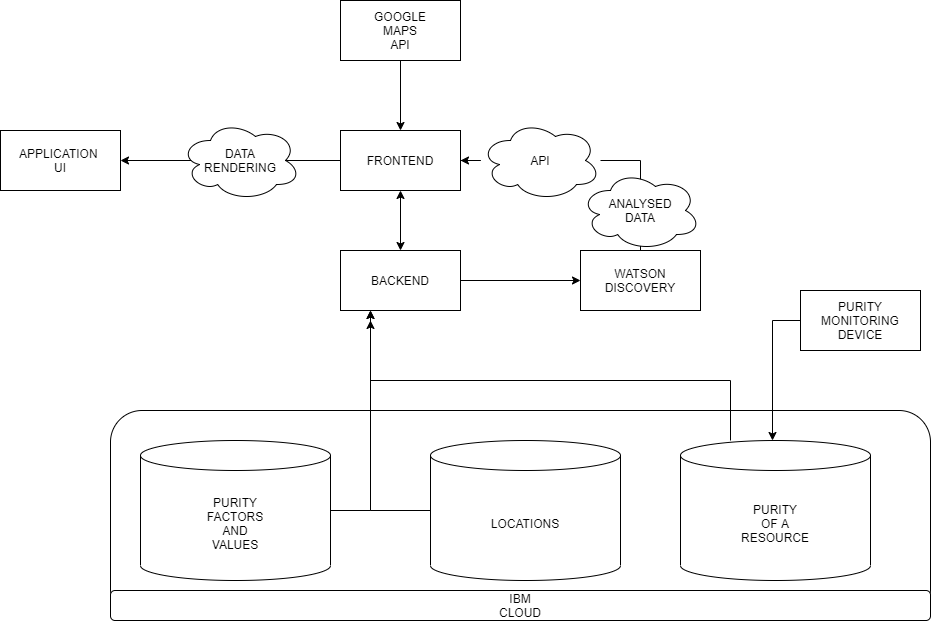

# WIT-ACE-HACKATHON-2021

THEME : "She the Force: Hack for Sustainability with Tech Solutions"

IDEA: AUTOMATED WATER QUALITY ANALYSIS AND PREDICTION

The Elixir of life on Earth- water -has a life of its own. A water body differs in how and where it is formed, what aquatic life it supports and most importantly how it is used by us, humans. Yet the factors for degradation are the same for all- and the list is topped by the climate crisis ascending to its peak.

Of all the problems that tremendous change in climate over a period of time brings along with it, the sustainability of life itself is questioned by the drop in quality in the estimated one percent fresh water available to us all around the world.

It has a become a challenge to effectively utilize the natural resource as well as succeeding in not turning it into a waste. 
Thus, we have come up with an idea that can help monitor the level of water quality in known areas, widening the public knowledge on such issues and providing implications on how best the water at different places can be used. 

Our solution involves tracking and recording water quality in real time , based on several integrants. To test the caliber, an IoT device based on GSM system comprising  of the following is used: a pH sensor, temperature sensor, turbidity sensor, single chip micro-controller , a data acquisition module and an information transition module.

The said device is designed so as to record and send the recorded data to be stored in the IBM cloudant for further processing.
IBM Watson Discovery is then fed  the recorded data in IBM Cloud by using Node js. It’s incorporated Artificial Intelligence search technology helps in analyzing trends and relationships buried in the data; consequently providing with optimized information from the collection of original data. 
			
This information is retrieved and then updated in a webpage on a regular basis – for the reference of users – along with visual indicators for various aspects of the water standard , enabling easy understanding of the jargon involved by the average users of the application. 
The webpage is embedded with Google Maps API – this is for the facilitation of the feature to view gathered data in any location of interest for the user in the Maps. 
The website projecting useful stats on an everyday basis can also assist in forging a general notion on how well a water body in surrounding locations is maintained.
                                                                           

ARCHITECTURE

VIDEO DESCRIPTION

Conclusion

The system can be used for both domestic and commercial purposes further highly benefitting water supply agencies. It is economically affordable as it is of low maintenance and would be the best gift to the human society by preventing waterborne diseases as it predicts and recommends quality water resources.

Created BY 

TEAM NAME - TECH SQUAD

TEAM MEMBERS

1.BYNA RITHIKA
2.AISHWARYA J
3.ANANDHITHA T R
4.DINESH KUMAR G
5.DINESH P N

